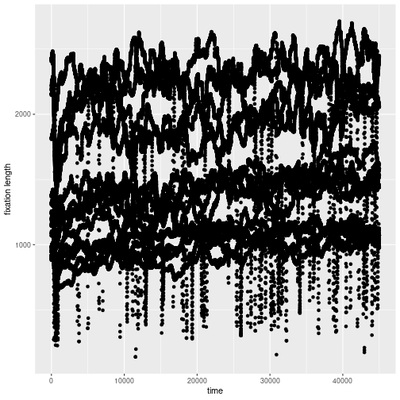
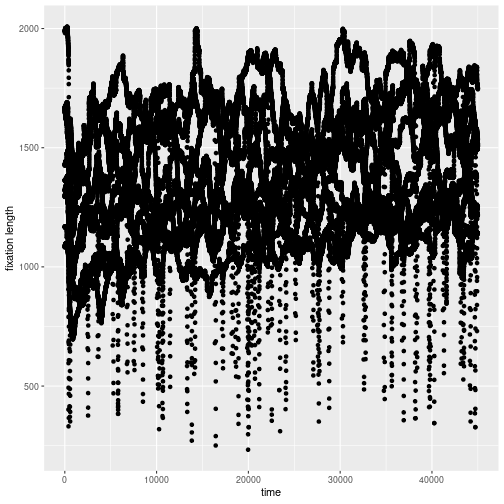
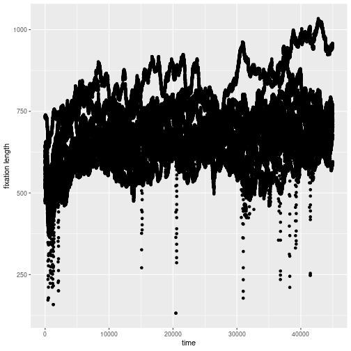
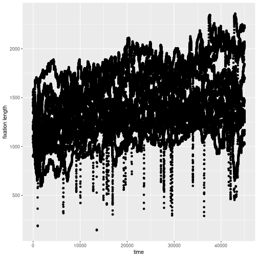
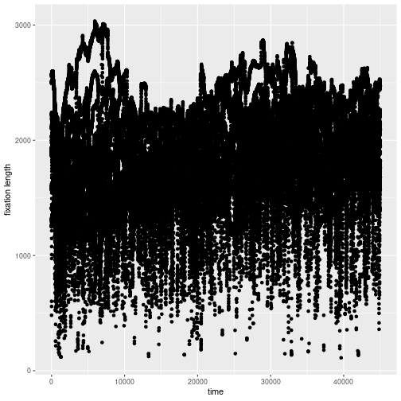
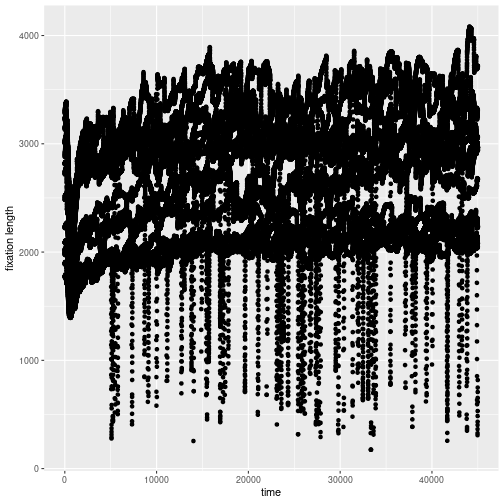
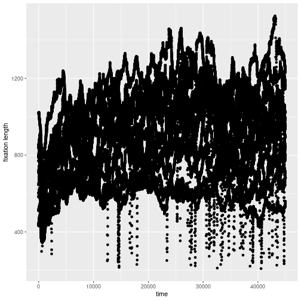

## Load libraries


```r
library(raster)
library(imager)
library(tidyverse)
library(here)
library(ez)
library(saccades)
require(ggplot2) 

library(papaja)


source("solution.R") # functions are in separate file for easier debugging
```

## Download data

Download zip file from the web page. Description of the dataset is on the page [ETRA dataset description](https://etra.acm.org/2019/challenge.html)


```r
data_pth <- "data"
if(!dir.exists(data_pth)) {
  dir.create(data_pth)
}
# uncomment following file for downloading data
# download.file("http://smc.neuralcorrelate.com/ETRA2019/ETRA2019Challenge.zip",here(data_pth,"ETRA2019Challenge.zip"))
```

Than unzip data and move them to the folder. The directory *data* should therefore contain following directories/files

- data
- images
- DataSummary.csv

## Load data

You can use *readr* package, which is supplied within *tidyverse* package bundle. Multiple files can be read using these lines of code. For example, we want only load Free viewing condition in Puzzle subtask for subject 9


```r
# local_data_pth <- here(data_pth, "data", "009")
# files <- dir(local_data_pth, pattern = ".*Fixation_Puzzle_.*.csv") # get file names

# df_fix_puzzle <- files %>%
#   map(read_data) %>% 
#   reduce(rbind) %>% as_tibble()

# local_data_pth <- here(data_pth, "data", "009")
# files <- dir(local_data_pth, pattern = ".*Fixation_Waldo_.*.csv") # get file names

# df_fix_waldo <- files %>%
#   map(read_data) %>% 
#   reduce(rbind) %>% as_tibble()
```

You can easily adjust this code for your hypotheses.

## Hypotheses

All the hypotheses apply to the "puzzle task" experiments:

1. Is the length of fixations dependent on whether it is directed at a location close to the differences in the puzzle experiments?
2. Is the length of fixations dependent on the distance from the boundary of the image?
3. Is there any significant dependence of pupil dilatation on time?

## Data manipulation

In the whole analysis for all hypotheses we simplify the data by taking averages of values of both eyes instead of the values themselves wherever applicable (pupil dilatations, x/y locations, etc.).

In the analysis for the first two hypotheses, we use the provided method for detecting fixations, for the first hypothesis we compute the difference of the left and the right image, this is done by taking the top 3% percentile of pixels with the greatest color distance (using the Euclidean metric). This leaves us with a lot of edges and textured areas as false positives so the script uses "CannyEdge" edge detection to partially correct this.

But even with the false positives we should get at least partially consistent correlation if the hypotheses are true.

## Data

We will perform correlation checks for all relations suggested by the hypotheses. If there is a significant correlation, we will perform t.tests on the data separated according to some threshold of one of the watched parameters and we will try to determine an approximation of one of the parameters on the other using linear regression.

The following script prints all the data used in the analysis and the plots for the third hypothesis (each plot representing the data collected for each participant):


```r
first_hyp()
```

```
## here go correlations of lengths of fixations and their distance from the assumed closest target: 
## participant  9 : 
## correlation of length of fixation and its distance from target in  1 :  0.02421356 
## correlation of length of fixation and its distance from target in  2 :  -0.00696832 
## correlation of length of fixation and its distance from target in  3 :  0.109531 
## correlation of length of fixation and its distance from target in  4 :  0.01291818 
## correlation of length of fixation and its distance from target in  5 :  0.00044308 
## correlation of length of fixation and its distance from target in  6 :  -0.1263372 
## correlation of length of fixation and its distance from target in  7 :  -0.09601439 
## correlation of length of fixation and its distance from target in  8 :  -0.01050749 
## correlation of length of fixation and its distance from target in  9 :  0.07857743 
## correlation of length of fixation and its distance from target in  10 :  -0.0745141 
## correlation of length of fixation and its distance from target in  11 :  0.02592986 
## correlation of length of fixation and its distance from target in  12 :  -0.09552726 
## correlation of length of fixation and its distance from target in  13 :  -0.1510649 
## correlation of length of fixation and its distance from target in  14 :  -0.1326136 
## correlation of length of fixation and its distance from target in  15 :  -0.05537004 
## total correlation of length of fixation and its distance from target :  -0.04094406 
## participant  19 : 
## correlation of length of fixation and its distance from target in  1 :  -0.1319938 
## correlation of length of fixation and its distance from target in  2 :  -0.1045739 
## correlation of length of fixation and its distance from target in  3 :  0.07335972 
## correlation of length of fixation and its distance from target in  4 :  0.02422126 
## correlation of length of fixation and its distance from target in  5 :  0.01957813 
## correlation of length of fixation and its distance from target in  6 :  0.09881184 
## correlation of length of fixation and its distance from target in  7 :  -0.009676994 
## correlation of length of fixation and its distance from target in  8 :  -0.03904533 
## correlation of length of fixation and its distance from target in  9 :  -0.07243768 
## correlation of length of fixation and its distance from target in  10 :  -0.08989861 
## total correlation of length of fixation and its distance from target :  -0.01610527 
## participant  22 : 
## correlation of length of fixation and its distance from target in  1 :  0.02064465 
## correlation of length of fixation and its distance from target in  2 :  -0.1334085 
## correlation of length of fixation and its distance from target in  3 :  0.05271491 
## correlation of length of fixation and its distance from target in  4 :  0.07763369 
## correlation of length of fixation and its distance from target in  5 :  -0.05022205 
## correlation of length of fixation and its distance from target in  6 :  -0.07052135 
## correlation of length of fixation and its distance from target in  7 :  -0.05037292 
## correlation of length of fixation and its distance from target in  8 :  -0.01657375 
## correlation of length of fixation and its distance from target in  9 :  0.04369591 
## correlation of length of fixation and its distance from target in  10 :  -0.05604904 
## correlation of length of fixation and its distance from target in  11 :  0.06615146 
## correlation of length of fixation and its distance from target in  12 :  -0.1903581 
## correlation of length of fixation and its distance from target in  13 :  0.1697283 
## correlation of length of fixation and its distance from target in  14 :  -0.07743852 
## correlation of length of fixation and its distance from target in  15 :  0.1021546 
## total correlation of length of fixation and its distance from target :  -0.0196724 
## participant  58 : 
## correlation of length of fixation and its distance from target in  1 :  -0.1482411 
## correlation of length of fixation and its distance from target in  2 :  -0.2895495 
## correlation of length of fixation and its distance from target in  3 :  0.07512979 
## correlation of length of fixation and its distance from target in  4 :  -0.04593118 
## correlation of length of fixation and its distance from target in  5 :  -0.009225387 
## correlation of length of fixation and its distance from target in  6 :  -0.024165 
## correlation of length of fixation and its distance from target in  7 :  0.05127563 
## correlation of length of fixation and its distance from target in  8 :  0.04728343 
## correlation of length of fixation and its distance from target in  9 :  -0.04902852 
## correlation of length of fixation and its distance from target in  10 :  0.009804643 
## correlation of length of fixation and its distance from target in  11 :  -0.02955648 
## correlation of length of fixation and its distance from target in  12 :  -0.05844977 
## correlation of length of fixation and its distance from target in  13 :  -0.1234377 
## correlation of length of fixation and its distance from target in  14 :  0.05361566 
## correlation of length of fixation and its distance from target in  15 :  0.1012264 
## total correlation of length of fixation and its distance from target :  -0.09518138 
## participant  59 : 
## correlation of length of fixation and its distance from target in  1 :  0.0795556 
## correlation of length of fixation and its distance from target in  2 :  0.1202648 
## correlation of length of fixation and its distance from target in  3 :  0.1028179 
## correlation of length of fixation and its distance from target in  4 :  -0.06134059 
## correlation of length of fixation and its distance from target in  5 :  0.06688221 
## correlation of length of fixation and its distance from target in  6 :  -0.140325 
## correlation of length of fixation and its distance from target in  7 :  0.05431032 
## correlation of length of fixation and its distance from target in  8 :  0.008544009 
## correlation of length of fixation and its distance from target in  9 :  0.187991 
## correlation of length of fixation and its distance from target in  10 :  0.002407716 
## correlation of length of fixation and its distance from target in  11 :  -0.1072862 
## correlation of length of fixation and its distance from target in  12 :  -0.1960128 
## correlation of length of fixation and its distance from target in  13 :  0.1346123 
## correlation of length of fixation and its distance from target in  14 :  -0.06296438 
## correlation of length of fixation and its distance from target in  15 :  -0.1318202 
## total correlation of length of fixation and its distance from target :  -0.004124556 
## participant  60 : 
## correlation of length of fixation and its distance from target in  1 :  -0.154434 
## correlation of length of fixation and its distance from target in  2 :  -0.1078771 
## correlation of length of fixation and its distance from target in  3 :  0.1352927 
## correlation of length of fixation and its distance from target in  4 :  0.08842867 
## correlation of length of fixation and its distance from target in  5 :  -0.0646814 
## correlation of length of fixation and its distance from target in  6 :  -0.006689772 
## correlation of length of fixation and its distance from target in  7 :  0.04470462 
## correlation of length of fixation and its distance from target in  8 :  0.02978639 
## correlation of length of fixation and its distance from target in  9 :  0.06646774 
## correlation of length of fixation and its distance from target in  10 :  -0.0008625002 
## correlation of length of fixation and its distance from target in  11 :  0.02393944 
## correlation of length of fixation and its distance from target in  12 :  -0.1422582 
## correlation of length of fixation and its distance from target in  13 :  0.01695833 
## correlation of length of fixation and its distance from target in  14 :  -0.05739342 
## correlation of length of fixation and its distance from target in  15 :  -0.05022345 
## total correlation of length of fixation and its distance from target :  0.01551761 
## participant  62 : 
## correlation of length of fixation and its distance from target in  1 :  -0.06878474 
## correlation of length of fixation and its distance from target in  2 :  0.01030344 
## correlation of length of fixation and its distance from target in  3 :  0.01183205 
## correlation of length of fixation and its distance from target in  4 :  -0.07332242 
## correlation of length of fixation and its distance from target in  5 :  0.05155772 
## correlation of length of fixation and its distance from target in  6 :  0.03749616 
## correlation of length of fixation and its distance from target in  7 :  0.1177513 
## correlation of length of fixation and its distance from target in  8 :  -0.08914822 
## correlation of length of fixation and its distance from target in  9 :  0.07763539 
## correlation of length of fixation and its distance from target in  10 :  0.05055764 
## correlation of length of fixation and its distance from target in  11 :  -0.04283396 
## correlation of length of fixation and its distance from target in  12 :  -0.04331571 
## correlation of length of fixation and its distance from target in  13 :  -0.1043926 
## correlation of length of fixation and its distance from target in  14 :  0.002969826 
## correlation of length of fixation and its distance from target in  15 :  0.09061876 
## total correlation of length of fixation and its distance from target :  0.002622864 
## total correlation:  -0.02788962
```

```r
second_hyp()
```

```
## here go correlations of lengths of fixations and their distance from the edge of the image: 
## participant  9 : 
## correlation of length of fixation and its distance from edge in  1 :  0.07370558 
## correlation of length of fixation and its distance from edge in  2 :  -0.0298211 
## correlation of length of fixation and its distance from edge in  3 :  -0.0729992 
## correlation of length of fixation and its distance from edge in  4 :  0.07432345 
## correlation of length of fixation and its distance from edge in  5 :  0.007132603 
## correlation of length of fixation and its distance from edge in  6 :  -0.05025084 
## correlation of length of fixation and its distance from edge in  7 :  0.06382459 
## correlation of length of fixation and its distance from edge in  8 :  0.0765027 
## correlation of length of fixation and its distance from edge in  9 :  -0.0488307 
## correlation of length of fixation and its distance from edge in  10 :  -0.1587016 
## correlation of length of fixation and its distance from edge in  11 :  -0.02811973 
## correlation of length of fixation and its distance from edge in  12 :  -0.03245158 
## correlation of length of fixation and its distance from edge in  13 :  0.004392498 
## correlation of length of fixation and its distance from edge in  14 :  -0.05908022 
## correlation of length of fixation and its distance from edge in  15 :  0.02198878 
## total correlation of length of fixation and its distance from edge:  -0.01177616 
## participant  19 : 
## correlation of length of fixation and its distance from edge in  1 :  -0.02729792 
## correlation of length of fixation and its distance from edge in  2 :  0.0139171 
## correlation of length of fixation and its distance from edge in  3 :  -0.03846481 
## correlation of length of fixation and its distance from edge in  4 :  -0.003783302 
## correlation of length of fixation and its distance from edge in  5 :  -0.0004643638 
## correlation of length of fixation and its distance from edge in  6 :  -0.1767277 
## correlation of length of fixation and its distance from edge in  7 :  -0.09315457 
## correlation of length of fixation and its distance from edge in  8 :  0.01561136 
## correlation of length of fixation and its distance from edge in  9 :  -0.1711093 
## correlation of length of fixation and its distance from edge in  10 :  0.08629491 
## total correlation of length of fixation and its distance from edge:  -0.03310002 
## participant  22 : 
## correlation of length of fixation and its distance from edge in  1 :  -0.3237306 
## correlation of length of fixation and its distance from edge in  2 :  -0.002790895 
## correlation of length of fixation and its distance from edge in  3 :  -0.1423376 
## correlation of length of fixation and its distance from edge in  4 :  0.03464321 
## correlation of length of fixation and its distance from edge in  5 :  -0.07990108 
## correlation of length of fixation and its distance from edge in  6 :  0.05605754 
## correlation of length of fixation and its distance from edge in  7 :  0.1486309 
## correlation of length of fixation and its distance from edge in  8 :  -0.01270606 
## correlation of length of fixation and its distance from edge in  9 :  -0.05649941 
## correlation of length of fixation and its distance from edge in  10 :  0.01415173 
## correlation of length of fixation and its distance from edge in  11 :  -0.1829309 
## correlation of length of fixation and its distance from edge in  12 :  -0.03152475 
## correlation of length of fixation and its distance from edge in  13 :  -0.08446902 
## correlation of length of fixation and its distance from edge in  14 :  0.007931864 
## correlation of length of fixation and its distance from edge in  15 :  -0.02273225 
## total correlation of length of fixation and its distance from edge:  -0.0423779 
## participant  58 : 
## correlation of length of fixation and its distance from edge in  1 :  -0.08097356 
## correlation of length of fixation and its distance from edge in  2 :  -0.1287305 
## correlation of length of fixation and its distance from edge in  3 :  0.04563187 
## correlation of length of fixation and its distance from edge in  4 :  -0.006865038 
## correlation of length of fixation and its distance from edge in  5 :  -0.01324045 
## correlation of length of fixation and its distance from edge in  6 :  -0.1061609 
## correlation of length of fixation and its distance from edge in  7 :  -0.05528435 
## correlation of length of fixation and its distance from edge in  8 :  -0.1131878 
## correlation of length of fixation and its distance from edge in  9 :  -0.1949517 
## correlation of length of fixation and its distance from edge in  10 :  -0.04987169 
## correlation of length of fixation and its distance from edge in  11 :  -0.01995165 
## correlation of length of fixation and its distance from edge in  12 :  -0.1080505 
## correlation of length of fixation and its distance from edge in  13 :  -0.03627659 
## correlation of length of fixation and its distance from edge in  14 :  0.04541566 
## correlation of length of fixation and its distance from edge in  15 :  -0.01413584 
## total correlation of length of fixation and its distance from edge:  -0.07499945 
## participant  59 : 
## correlation of length of fixation and its distance from edge in  1 :  -0.02598525 
## correlation of length of fixation and its distance from edge in  2 :  0.03093816 
## correlation of length of fixation and its distance from edge in  3 :  -0.1272304 
## correlation of length of fixation and its distance from edge in  4 :  0.1341185 
## correlation of length of fixation and its distance from edge in  5 :  0.06644384 
## correlation of length of fixation and its distance from edge in  6 :  -0.01822353 
## correlation of length of fixation and its distance from edge in  7 :  -0.03173393 
## correlation of length of fixation and its distance from edge in  8 :  -0.1239595 
## correlation of length of fixation and its distance from edge in  9 :  0.06646556 
## correlation of length of fixation and its distance from edge in  10 :  0.04721214 
## correlation of length of fixation and its distance from edge in  11 :  -0.1312767 
## correlation of length of fixation and its distance from edge in  12 :  0.001281391 
## correlation of length of fixation and its distance from edge in  13 :  -0.03763218 
## correlation of length of fixation and its distance from edge in  14 :  -0.1279528 
## correlation of length of fixation and its distance from edge in  15 :  0.09705958 
## total correlation of length of fixation and its distance from edge:  -0.01250968 
## participant  60 : 
## correlation of length of fixation and its distance from edge in  1 :  -0.004754408 
## correlation of length of fixation and its distance from edge in  2 :  -0.02445197 
## correlation of length of fixation and its distance from edge in  3 :  -0.01663818 
## correlation of length of fixation and its distance from edge in  4 :  0.01153915 
## correlation of length of fixation and its distance from edge in  5 :  0.0390451 
## correlation of length of fixation and its distance from edge in  6 :  -0.07932492 
## correlation of length of fixation and its distance from edge in  7 :  -0.0486931 
## correlation of length of fixation and its distance from edge in  8 :  -0.07763422 
## correlation of length of fixation and its distance from edge in  9 :  -0.05790633 
## correlation of length of fixation and its distance from edge in  10 :  -0.1104029 
## correlation of length of fixation and its distance from edge in  11 :  0.04007577 
## correlation of length of fixation and its distance from edge in  12 :  0.1000556 
## correlation of length of fixation and its distance from edge in  13 :  0.05940984 
## correlation of length of fixation and its distance from edge in  14 :  0.01367377 
## correlation of length of fixation and its distance from edge in  15 :  -0.1265704 
## total correlation of length of fixation and its distance from edge:  -0.01750158 
## participant  62 : 
## correlation of length of fixation and its distance from edge in  1 :  0.01866562 
## correlation of length of fixation and its distance from edge in  2 :  0.08928265 
## correlation of length of fixation and its distance from edge in  3 :  -0.004770552 
## correlation of length of fixation and its distance from edge in  4 :  -0.0364317 
## correlation of length of fixation and its distance from edge in  5 :  0.04835222 
## correlation of length of fixation and its distance from edge in  6 :  0.0622789 
## correlation of length of fixation and its distance from edge in  7 :  0.1031318 
## correlation of length of fixation and its distance from edge in  8 :  0.1452982 
## correlation of length of fixation and its distance from edge in  9 :  0.03326273 
## correlation of length of fixation and its distance from edge in  10 :  0.07601725 
## correlation of length of fixation and its distance from edge in  11 :  0.05275161 
## correlation of length of fixation and its distance from edge in  12 :  0.03110939 
## correlation of length of fixation and its distance from edge in  13 :  0.02919452 
## correlation of length of fixation and its distance from edge in  14 :  0.09087114 
## correlation of length of fixation and its distance from edge in  15 :  0.04888279 
## total correlation of length of fixation and its distance from edge:  0.05094672 
## total correlation:  -0.01639937
```

```r
third_hyp()
```

```
## here go p.values for null hypothesis that pupil size among late fixations is the same as among early fixations: 
## participant  9 : 
## t.test ( 1 ): p.value =  0 
## t.test ( 2 ): p.value =  0 
## t.test ( 3 ): p.value =  0 
## t.test ( 4 ): p.value =  0 
## t.test ( 5 ): p.value =  0 
## t.test ( 6 ): p.value =  0.0005665802 
## t.test ( 7 ): p.value =  0 
## t.test ( 8 ): p.value =  0 
## t.test ( 9 ): p.value =  0 
## t.test ( 10 ): p.value =  0 
## t.test ( 11 ): p.value =  0 
## t.test ( 12 ): p.value =  0 
## t.test ( 13 ): p.value =  0 
## t.test ( 14 ): p.value =  0 
## t.test ( 15 ): p.value =  0 
## t.test (final): p.value =  0 
## participant  19 : 
## t.test ( 1 ): p.value =  0 
## t.test ( 2 ): p.value =  0 
## t.test ( 3 ): p.value =  0 
## t.test ( 4 ): p.value =  0 
## t.test ( 5 ): p.value =  0 
## t.test ( 6 ): p.value =  0 
## t.test ( 7 ): p.value =  0 
## t.test ( 8 ): p.value =  0 
## t.test ( 9 ): p.value =  0 
## t.test ( 10 ): p.value =  4.123498e-38 
## t.test (final): p.value =  0 
## participant  22 : 
## t.test ( 1 ): p.value =  0.0006275982 
## t.test ( 2 ): p.value =  7.413688e-83 
## t.test ( 3 ): p.value =  0 
## t.test ( 4 ): p.value =  0 
## t.test ( 5 ): p.value =  0 
## t.test ( 6 ): p.value =  0 
## t.test ( 7 ): p.value =  0 
## t.test ( 8 ): p.value =  0 
## t.test ( 9 ): p.value =  1.566694e-270 
## t.test ( 10 ): p.value =  1.691397e-109 
## t.test ( 11 ): p.value =  0 
## t.test ( 12 ): p.value =  0 
## t.test ( 13 ): p.value =  0 
## t.test ( 14 ): p.value =  3.170962e-124 
## t.test ( 15 ): p.value =  0 
## t.test (final): p.value =  0 
## participant  58 : 
## t.test ( 1 ): p.value =  0 
## t.test ( 2 ): p.value =  0 
## t.test ( 3 ): p.value =  0 
## t.test ( 4 ): p.value =  0 
## t.test ( 5 ): p.value =  0 
## t.test ( 6 ): p.value =  0 
## t.test ( 7 ): p.value =  0 
## t.test ( 8 ): p.value =  0 
## t.test ( 9 ): p.value =  0 
## t.test ( 10 ): p.value =  0 
## t.test ( 11 ): p.value =  0 
## t.test ( 12 ): p.value =  0 
## t.test ( 13 ): p.value =  0 
## t.test ( 14 ): p.value =  0 
## t.test ( 15 ): p.value =  0 
## t.test (final): p.value =  0 
## participant  59 : 
## t.test ( 1 ): p.value =  0 
## t.test ( 2 ): p.value =  0 
## t.test ( 3 ): p.value =  0 
## t.test ( 4 ): p.value =  5.217926e-319 
## t.test ( 5 ): p.value =  0 
## t.test ( 6 ): p.value =  0 
## t.test ( 7 ): p.value =  0.153018 
## t.test ( 8 ): p.value =  0 
## t.test ( 9 ): p.value =  0 
## t.test ( 10 ): p.value =  0 
## t.test ( 11 ): p.value =  1.244027e-45 
## t.test ( 12 ): p.value =  0 
## t.test ( 13 ): p.value =  1.130196e-177 
## t.test ( 14 ): p.value =  5.407432e-78 
## t.test ( 15 ): p.value =  0 
## t.test (final): p.value =  0 
## participant  60 : 
## t.test ( 1 ): p.value =  0 
## t.test ( 2 ): p.value =  0 
## t.test ( 3 ): p.value =  4.215703e-262 
## t.test ( 4 ): p.value =  0 
## t.test ( 5 ): p.value =  0 
## t.test ( 6 ): p.value =  0 
## t.test ( 7 ): p.value =  0 
## t.test ( 8 ): p.value =  0 
## t.test ( 9 ): p.value =  8.5342e-301 
## t.test ( 10 ): p.value =  1.429652e-202 
## t.test ( 11 ): p.value =  0 
## t.test ( 12 ): p.value =  0 
## t.test ( 13 ): p.value =  0 
## t.test ( 14 ): p.value =  5.002949e-134 
## t.test ( 15 ): p.value =  0 
## t.test (final): p.value =  0 
## participant  62 : 
## t.test ( 1 ): p.value =  0 
## t.test ( 2 ): p.value =  4.074262e-290 
## t.test ( 3 ): p.value =  0 
## t.test ( 4 ): p.value =  6.554013e-166 
## t.test ( 5 ): p.value =  0 
## t.test ( 6 ): p.value =  0 
## t.test ( 7 ): p.value =  0 
## t.test ( 8 ): p.value =  0 
## t.test ( 9 ): p.value =  0 
## t.test ( 10 ): p.value =  0 
## t.test ( 11 ): p.value =  0 
## t.test ( 12 ): p.value =  0 
## t.test ( 13 ): p.value =  2.033656e-55 
## t.test ( 14 ): p.value =  0 
## t.test ( 15 ): p.value =  0 
## t.test (final): p.value =  0 
## t.test (final): p.value =  0
```

```r
third_hyp_two()
```

```
## participant  9 : 
## correlation of pupil size and time in  9 : 0.1393031 
## participant  19 : 
## correlation of pupil size and time in  19 : 0.2236797 
## participant  22 : 
## correlation of pupil size and time in  22 : 0.3213286 
## participant  58 : 
## correlation of pupil size and time in  58 : 0.3458761 
## participant  59 : 
## correlation of pupil size and time in  59 : 0.2081884 
## participant  60 : 
## correlation of pupil size and time in  60 : 0.1975005 
## participant  62 : 
## correlation of pupil size and time in  62 : 0.2594866
```

```r
third_plot()
```



## Results

The analysis for the first two hypotheses shows no apparent correlation so they were not further investigated.

The analysis for the third hypothesis shows very strong correlation between time and pupil dilatation; and the t.test applied to the collected data split in two halves according to time (for each experiment, then for all each participant's experiments and finally for all experiments) confirms that the correlation isn't due to randomness (with probability of the difference consistently below any reasonable threshold). Applying `lm` to the data collected by the analysis for the third hypothesis gives us an approximation of the relation between the values as follows: `pupil dilatation = 1352.27 + .0054 * time`. The plots following the p.value and correlation reports then clearly show that the pupil dilatation tends to increase with time, despite the noise.

So we can conclude that the length of fixations isn't dependent on the distance from the target locations nor on the distance from the boundaries of the stimulus images; and that the pupil dilatation is indeed dependent on time.
